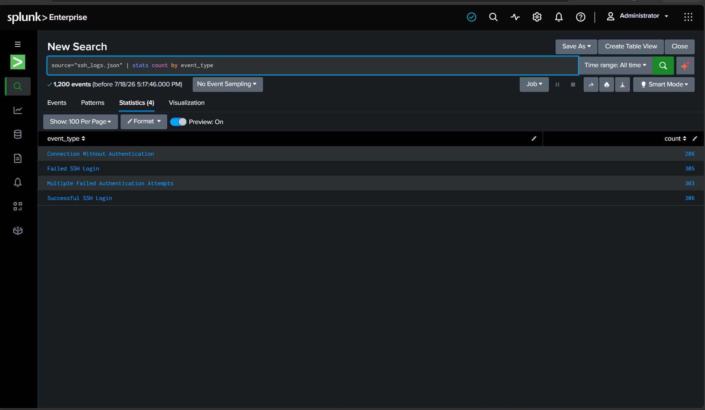
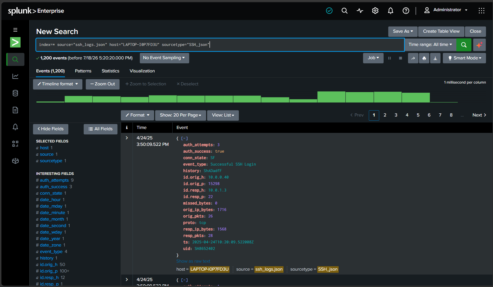
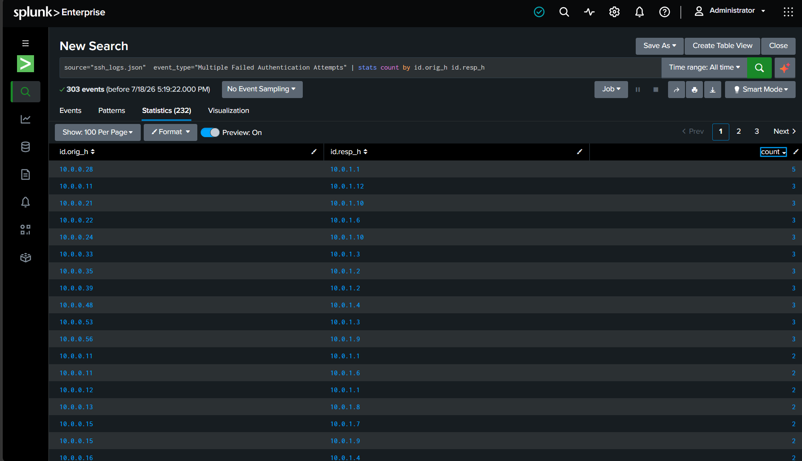
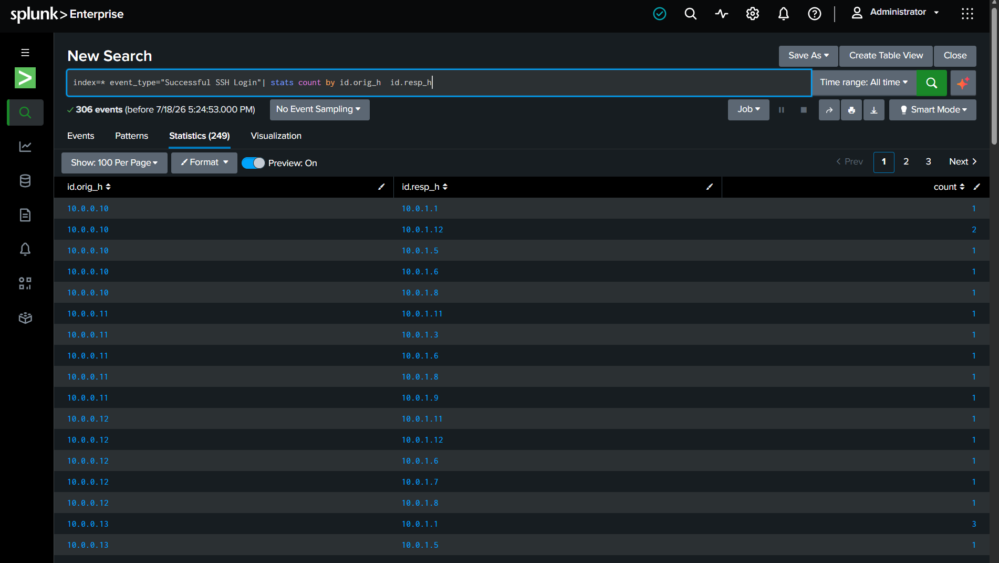

# SSH Log Analysis using Splunk

## Overview

This project analyzes SSH authentication logs (`ssh_logs.json`, Zeek/Bro-style connection format) ingested into **Splunk Enterprise** to detect and categorize suspicious SSH activity across a network of hosts.

The dataset contains **1,200 events** collected from host `LAPTOP-I0P7FD3U`, covering four distinct SSH event types:

| Event Type | Count | Description |
|---|---|---|
| Successful SSH Login | 306 | Authenticated sessions established |
| Failed SSH Login | 305 | Single failed authentication attempt |
| Multiple Failed Authentication Attempts | 303 | Repeated failed logins from the same source (possible brute-force) |
| Connection Without Authentication | 286 | Connections established without a completed auth handshake |

## Dataset Fields

Each log event is a Zeek-style SSH connection record with fields including:

```
auth_attempts, auth_success, conn_state, event_type, history,
id.orig_h, id.orig_p, id.resp_h, id.resp_p, missed_bytes,
orig_ip_bytes, orig_pkts, proto, resp_ip_bytes, resp_pkts, ts, uid
```

- `id.orig_h` / `id.orig_p` — source IP / port (the connecting client)
- `id.resp_h` / `id.resp_p` — destination IP / port (the SSH server)
- `auth_attempts` — number of authentication attempts in the session
- `event_type` — classification label used for this analysis

## Splunk Search Queries Used

All queries are also available in [`queries.spl`](./queries.spl).

**1. Ingest & source filter**
```spl
index=* source="ssh_logs.json" host="LAPTOP-I0P7FD3U" sourcetype="SSH_json"
```

**2. Event type breakdown (overall summary)**
```spl
source="ssh_logs.json" | stats count by event_type
```

**3. Top source IPs for brute-force attempts**
```spl
source="ssh_logs.json" event_type="Multiple Failed Authentication Attempts"
| stats count by id.orig_h id.resp_h
```

**4. Successful login source/destination pairs**
```spl
index=* event_type="Successful SSH Login" | stats count by id.orig_h id.resp_h
```

**5. Connections without authentication — activity over time**
```spl
index=* event_type="Connection Without Authentication" | timechart count by id.orig_h
```

## Findings

- **Event type overview** — a near-even split (~300 events each) across all four categories, meaning roughly 3 out of 4 SSH connections in this dataset did *not* end in a clean successful login.

  

- **Raw log sample** — confirms the schema and shows a genuine `Successful SSH Login` from `10.0.0.40 → 10.0.1.3` with `auth_attempts: 3`.

  

- **Brute-force indicators** — `stats count by id.orig_h id.resp_h` on the "Multiple Failed Authentication Attempts" event type surfaces repeat offenders. `10.0.0.28 → 10.0.1.1` stands out with **5** failed-attempt events against a single target — the highest of any pair — a strong brute-force signal worth alerting on.

  

- **Successful login pairs** — cross-referencing successful logins against the same source IPs helps confirm whether a brute-forcing host ever succeeded in authenticating (lateral movement risk).

  

- **Unauthenticated connections over time** — connections with no completed auth handshake are spread across many source IPs (`10.0.0.10` through `10.0.0.53` and others), suggesting either scanning activity or misconfigured clients rather than one single attacker.

  

## Recommendations

1. **Alert on repeated brute-force pairs** — set a Splunk alert for any `id.orig_h`/`id.resp_h` pair exceeding 3+ "Multiple Failed Authentication Attempts" events in a rolling window.
2. **Correlate failed → successful logins** — flag any source IP that appears in both the brute-force list and the successful-login list; this indicates a possibly compromised credential.
3. **Investigate "Connection Without Authentication" spikes** — these may indicate port scanning or SSH banner grabbing and should be cross-checked against a firewall/IDS.
4. **Baseline normal auth_attempts** — most successful logins should have low `auth_attempts`; use this as an anomaly threshold.

## Tools Used

- Splunk Enterprise (SPL — Search Processing Language)
- Zeek/Bro-style SSH connection logs (JSON)

## Author

Add your name / GitHub profile link here.
